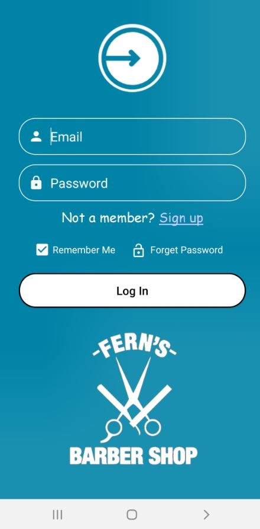

# Barbarshop Booking - Android App

 
Barbershop booking is a application of Schedule appointments to the barbershop. 
So, don't wasting your time on the phone and book an appointment now with a click :)
 
This app was written as part of Android Application Development Course (Part 2)
The course is taught at HIT (Holon Institute of Technology) by lecturer Mr. Effi Propus.
This course is a continuation of Android Application Development Course Part 1.
In this course, we learned advanced topics in Android app development.

 

## About

This app was written to make appointment to the barbershop quick and easy.
The app shows the available dates and times and allows you to order with one simple click.  
You can see prices, history of appointments and more.
 
The app database is Firebase and it used to read and write all data of the app (Users, Prices andm more).
 
 
This application was originally created by Dvir Sender and Ron Peretz

## Features

With this app we learned the following features:
- Fragments
- RecycleView
- Google Firebase
- Working with NoSQL database
- SharedPreference
- XML
- Using external APIs
- And other cool things

## Screenshots

## Permissions

On Android versions prior to Android 6.0, this app requires the following permissions:
- Full Network Access.
- Read and write access to external storage.
